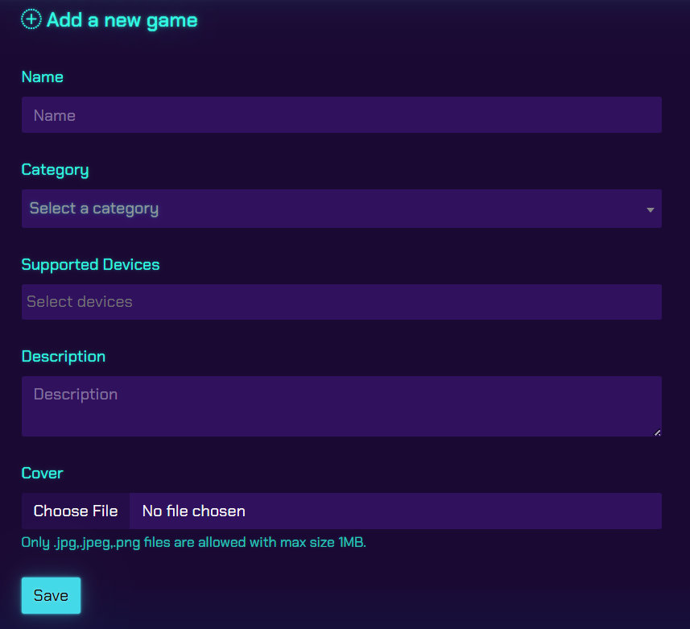
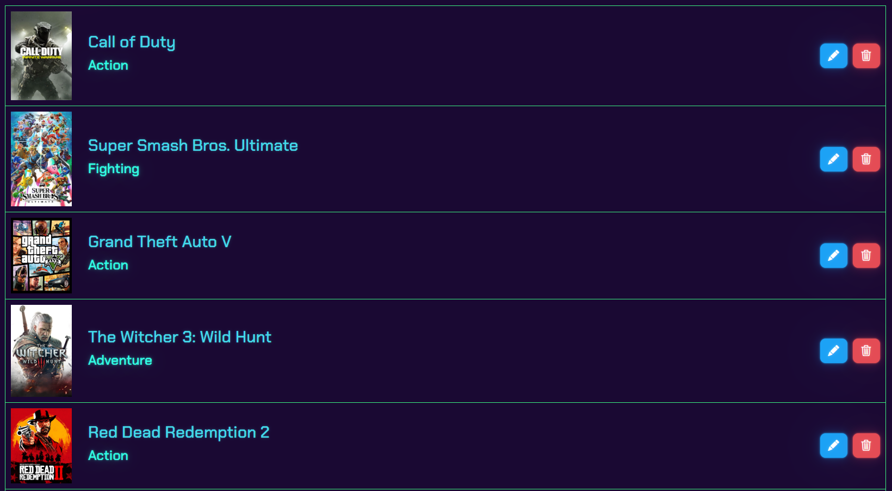
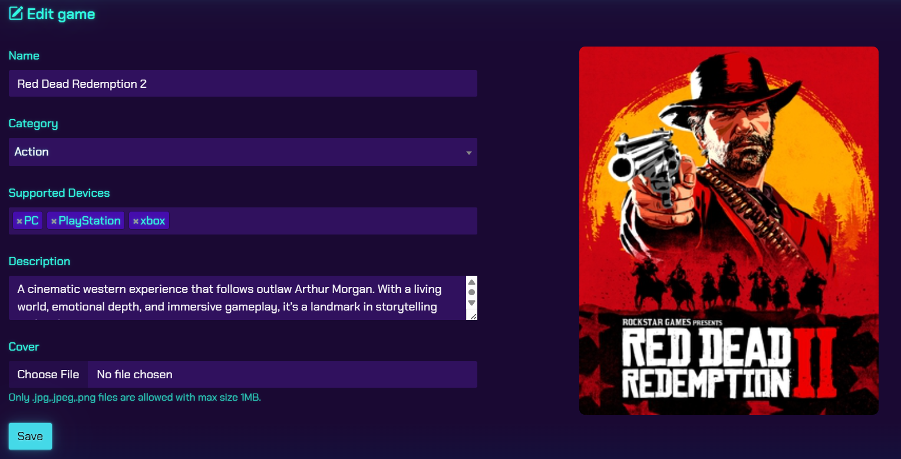
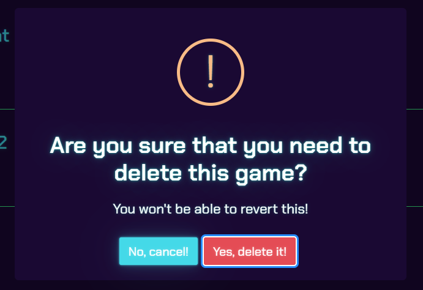
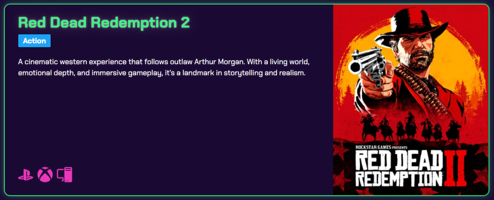

# Game Zone 🎮

Game Zone is an ASP.NET MVC web application that provides full CRUD (Create, Read, Update, Delete) functionality for managing a collection of games.  
It features:
- Server-side image storage (only filenames saved in DB).
- Automatic image deletion when a game is removed.
- Deletion confirmation alerts.
- Complete client-side and server-side validations.

---

## 📂 Features Overview

| Operation | Description | Example Screenshot | Key Code Highlights |
|-----------|-------------|--------------------|---------------------|
| Create | Add a new game with details and an uploaded image. Validations run on both client and server. |  | - Save image to server<br>- Store filename in DB<br>- Use [Required] attributes in model |
| Read | View all games with details and images. |  | - GameController.Index() fetches all records<br>- Razor views to loop and display |
| Update | Edit game details, with option to replace image. |  | - Check if new image uploaded<br>- Replace file on server<br>- Update DB record |
| Delete | Show confirmation alert before deleting game. If confirmed, remove record and image file. |  | - confirm() in JavaScript for alert<br>- Delete file from server using System.IO.File.Delete() |
| Get Game | Display a single game's details by ID. |  | - GameController.Details(id) fetches specific record |

---

## 🛠 Tech Stack
- Language: C#
- Framework: ASP.NET MVC
- Database: SQL Server
- Frontend: HTML, CSS, Bootstrap, JavaScript
- Image Storage: Local server storage

---

## 📖 How It Works
1. Image Upload:
   - Stored in ~/Uploads folder.
   - Only filename with extension saved in DB.
2. Image Delete:
   - Triggered only if record deletion confirmed.
   - Deletes from both DB and server file system.
3. Validation:
   - Client-side: JavaScript + Data Annotations for instant feedback.
   - Server-side: ASP.NET ModelState validation to ensure data integrity.

---

## 🚀 Getting Started
1. Clone the repository:
   ```bash
   git clone https://github.com/Youssef-Darrag/Game-Zone.git

2. Open in Visual Studio.


3. Update the database connection string in appsettings.json.


4. Ensure the Uploads folder exists and has write permissions.


5. Run the application.


---

💡 Purpose

Practice ASP.NET MVC with real-world CRUD operations.

Handle image uploads securely.

Demonstrate both client-side and server-side validation.

Improve UX with confirmation alerts.


---

🤝 Contributing

1. Fork the repository
2. Create a feature branch
3. Make your changes
4. Add tests if applicable
5. Submit a pull request


---

📜 License

This project is licensed under the MIT License.


---

🆘 Support

For support and questions, please open an issue in the repository.
